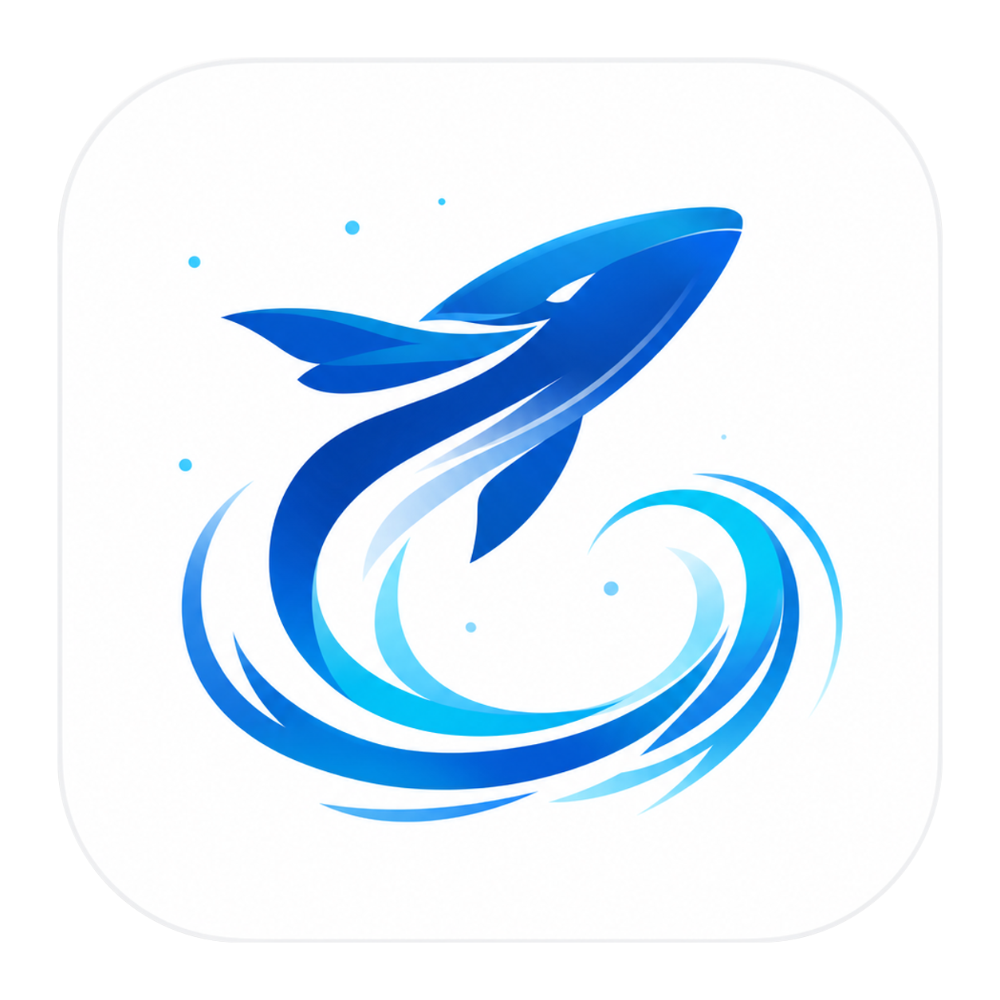

<p align="center">
  
</p>

<h1 align="center">Kun</h1>

<p align="center">
  <strong>An experiment in requirement-first coding for the next programming paradigm.</strong><br>
  Use DeepSeek, Xiaomi MiMo, and MiniMax to connect requirements, Design, Code, and Write into one loop.
</p>

<p align="center">
  <a href="./README.md">简体中文</a>
  &nbsp;·&nbsp;
  <strong>English</strong>
  &nbsp;·&nbsp;
  <a href="https://github.com/KunAgent/Kun/releases">Download</a>
  &nbsp;·&nbsp;
  <a href="#documentation-map">Docs</a>
  &nbsp;·&nbsp;
  <a href="#path-b-run-from-source">Run from source</a>
</p>

<p align="center">
  <a href="https://github.com/KunAgent/Kun/releases"></a>
  <a href="./LICENSE"></a>
  
  
  
</p>

Kun is a product experiment for the future of programming: instead of starting from “ask the agent to edit code,” it starts from requirement clarification and connects requirement documents, Design drafts, interactive prototypes, implementation plans, todos, agent coding, and change review in one GUI workflow.

Kun is for users who want to put AI agents into real everyday work. It is not just a chat client, and it is not only a CLI shell for programmers: in Code mode you can hand it a local folder for code, requirements, plans, and change review; in Design mode you can generate and iterate UI drafts, interactive prototypes, and a shared design system; in Write mode you can work on long-form Markdown, editing, and document export.

This is also why Kun treats DeepSeek, Xiaomi MiMo, and MiniMax as the default first-class model stack, not just ordinary optional providers. Requirement-first coding requires more rounds of clarification, research, structuring, planning, execution, and verification. If model cost is too high, that richer workflow cannot become an everyday habit. Kun chooses three cost-efficient Chinese model providers so the full loop is affordable to run, repeat, and refine.

Kun includes the local `kun serve` runtime for the desktop app. Preferences, sessions, logs, and runtime config stay on your machine; model calls use your own provider credentials. For workflows that can read/write files or run commands, Kun gives you tool approvals, filesystem permission modes, inline diffs, and a change-review panel.

---

<p align="center">
  <a href="src/asset/img/code.mp4">
    
  </a>
  <a href="src/asset/img/write.mp4">
    
  </a>
</p>

## Requirement-First Coding

Kun explores a next-generation programming workflow: **requirement -> design -> plan -> code -> verify**. It is not just a chat box attached to an IDE.

That workflow is carried by three first-class modes: **Code** for real repositories and shipping changes, **Design** for UI direction, prototypes, and design systems, and **Write** for long-form documents, requirements, release notes, and essays. All three share the same Kun runtime, provider config, approvals, and thread capabilities.

| Stage | Kun's approach |
| --- | --- |
| **Clarify** | Create requirement drafts in the GUI and ask Requirement AI to find missing questions, research options, and shape boundaries |
| **Document** | Save drafts as `.kunsdd/draft/.../requirement.md`, with structured requirement blocks, acceptance criteria, and requirement history |
| **Design** | Enter Design mode to generate UI drafts, infographics, interactive HTML prototypes, and a shared design system from requirement selections, so requirements become more than text |
| **Plan** | Use `/plan` and `create_plan` to produce GUI-owned `.kunsdd/plan/...` implementation plans linked back to requirements |
| **Code** | Move from plan into todos, file edits, command execution, and change review; when requirements change, Kun can surface affected replanning |
| **Verify** | Bring requirement blocks, acceptance criteria, plan state, and `/review` back together to answer whether the original requirement is done |

This is Kun's most important product direction: moving AI coding from instant Q&A into a requirement-driven software production workflow. Code, Design, Write, models, planning, review, and automation all serve that line.

## Core Model Stack

Kun optimizes for **complete capability + extreme cost efficiency**. A requirement-first workflow is longer than ordinary chat and depends on repeated model calls; first-run setup and provider settings are organized around three Chinese model providers so users can cover more agent scenarios with lower model cost.

| Provider | Role in Kun |
| --- | --- |
| **DeepSeek** | Default text and reasoning provider with `deepseek-v4-pro` / `deepseek-v4-flash`, powering coding, planning, review, long-context sessions, and auto model routing |
| **Xiaomi MiMo** | Cost-efficient multimodal and speech entry point, covering long-context text models, vision input, ASR transcription, TTS generation, and Token Plan |
| **MiniMax** | Full media generation complement, covering Anthropic Messages text models, image generation, speech generation, music generation, video generation, and Token Plan |

This stack lets Kun route different jobs to the right capability: fast models for lightweight clarification, stronger models for complex coding and reasoning, speech for writing and IM flows, and image/music/video generation for design and creative work. You can still add OpenAI-compatible, self-hosted, or other custom providers, but Kun's default experience is built around these three cost-efficient model services.

## Why Kun

| You want | Kun provides |
| --- | --- |
| A next-generation coding workflow | Requirement clarification, requirement documents, design drafts, implementation plans, agent coding, and verification in one line |
| Design in the same app | Design mode generates UI drafts, interactive HTML prototypes, node-based design flows, and a shared `DESIGN_SYSTEM.md`, then hands approved work to Code |
| Complete agent capability at extreme cost efficiency | DeepSeek, Xiaomi MiMo, and MiniMax as the core stack for text, reasoning, vision, speech, image, music, and video |
| AI that works on real projects | Bind a local workspace, read and edit files, search code, run commands, and inspect tool calls and results |
| Requirements that become executable plans | New requirements, `/plan`, todos, `/goal`, side conversations, thread compaction, forking, and archiving |
| Controlled changes | Tool approvals, filesystem permission modes, inline diffs, a change-review panel, and `/review` |
| Writing in the same app | Markdown file tree, Live / Source / Split / Preview, export formats, and selection-based inline agent actions |
| Remote or background triggers | Feishu / Lark / WeChat connection, local webhook / relay, and one-time or recurring scheduled tasks |
| Reusable workflows for repeatable processes | Visual "Create Loop" node editor to draw, run, and reuse multi-step agent flows |
| More than one model vendor | Custom Base URLs, protocols, model lists, and capability extensions beyond the three core providers |

## Core Features

- **Requirement-first coding**: draft requirements, clarify and structure them with AI, generate design drafts or prototypes, then move into implementation plans, todos, agent coding, and verification.
- **Code workbench**: bind a local project folder, chat around real codebases, read and edit files, run commands, and inspect tool calls and file changes.
- **Design mode**: generate design drafts, interactive HTML prototypes, and design flow graphs from natural language, requirement drafts, or existing UI; iterate versions, preview on canvas, export, publish a shared design system, and hand designs to Code for implementation.
- **Planning and review**: new requirements, `/plan`, todos, `/goal`, `/review`, side conversations, thread compaction, forking, and archiving.
- **Controlled changes**: inline diffs, a change-review panel, tool approvals, and filesystem permission modes.
- **Write mode**: dedicated Markdown workspaces with a file tree, Live / Source / Split / Preview modes, completion, selection-based inline agent actions, and `HTML / PDF / DOC / DOCX` export.
- **Connect phone**: Feishu / Lark / WeChat IM agents, local webhook / relay support, and one-time, daily, interval, or manual scheduled tasks.
- **Visual workflows (Create Loop)**: an n8n / dify-style node canvas on top of scheduled tasks that turns multi-step agent flows into runnable, reusable workflows — rich triggers and nodes, typed dataflow, a local run API, exposable to Kun as a tool, and bindable to hook phases.
- **Model-stack-first**: first-run setup, provider presets, and capability auto-wiring are designed around DeepSeek, Xiaomi MiMo, and MiniMax as a cost-efficient full agent stack.
- **Multimodal and media capabilities**: image attachments, vision input, speech transcription, image generation, speech generation, music generation, and video generation, enabled by provider configuration.
- **MCP and Skills**: Model Context Protocol servers and project/global Skills give Kun specialized tools and workflows for different tasks.
- **Local runtime**: `kun serve` provides the HTTP/SSE boundary with a cache-first agent loop, append-only event logs, usage tracking, and context compaction.

## More Demos

<p align="center">
  <a href="src/asset/img/pdf-research.mp4">
    
  </a>
</p>
<p align="center"><em>PDF research and source organization demo</em></p>

<p align="center">
  <a href="src/asset/img/sdd.mp4">
    
  </a>
</p>
<p align="center"><em>Requirement clarification, requirement documents, and planning demo</em></p>

<p align="center">
  <a href="src/asset/img/ikun-ui-plugin.mp4">
    
  </a>
</p>
<p align="center"><em>iKun UI plugin demo</em></p>

## Quick Start

### Path A: Download a Release

Download the latest build from [GitHub Releases](https://github.com/KunAgent/Kun/releases).

| Platform | Package | Architecture |
| --- | --- | --- |
| macOS | `.dmg` or `.zip` | Intel / Apple Silicon |
| Windows | `.exe`, NSIS installer | x64 |
| Linux | `.AppImage` | x64 |

On first launch:

1. Choose a UI language.
2. Choose a model provider and enter an API key or Token Plan key.
3. For compatible providers, edit the Base URL, protocol, and model list in Settings.
4. Open Code to bind a local project, open Design to generate a prototype, or open Write to create a writing workspace.

### Path B: Run From Source

Requirements:

| Dependency | Version |
| --- | --- |
| Node.js | 20+ |
| npm | Ships with Node.js |
| Model credentials | At least one of DeepSeek / Xiaomi MiMo / MiniMax / custom provider |

```bash
git clone https://github.com/KunAgent/Kun.git
cd Kun
npm install
npm run dev
```

For slower network access in mainland China, use an npm mirror:

```bash
npm install --registry=https://registry.npmmirror.com
```

## Common Commands

| Command | Description |
| --- | --- |
| `npm run dev` | Build the Kun runtime and start the Electron dev app |
| `npm run build` | Production build |
| `npm run typecheck` | TypeScript type checking |
| `npm run lint` | ESLint checks |
| `npm run test` | Vitest tests |
| `npm run dist:mac` | Build macOS `.dmg` and `.zip` |
| `npm run dist:win` | Build the Windows NSIS installer |
| `npm run dist:linux` | Build the Linux AppImage |

## Configuration and Data

- Preferences, sessions, logs, runtime config, and local runtime data stay on your machine by default.
- Model calls use the provider credentials you configure; provider presets are editable starting points.
- Code / Design / Write / Connect Phone share the same `kun` runtime boundary for sessions, approvals, tools, and usage tracking.
- File writes, command execution, MCP tools, and media generation are governed by permissions and configuration.

## Documentation Map

| Doc | Contents |
| --- | --- |
| [kun/README.md](kun/README.md) | Kun runtime, CLI, environment variables, HTTP API |
| [docs/kun-architecture.en.md](docs/kun-architecture.en.md) | Runtime architecture and GUI integration |
| [docs/kun-cache-optimization.en.md](docs/kun-cache-optimization.en.md) | Cache optimization and token economy |
| [docs/DESIGN_MODE.md](docs/DESIGN_MODE.md) | Design mode, canvas, prototypes, design systems, and the Design -> Code loop |
| [docs/model-provider-presets.md](docs/model-provider-presets.md) | Model provider presets |
| [docs/workflow-loop.en.md](docs/workflow-loop.en.md) | The Loop node and the loop-agent idea (Create Loop workflows) |
| [docs/CONTRIBUTING.en.md](docs/CONTRIBUTING.en.md) | Contribution guide |
| [docs/DEVELOPMENT.en.md](docs/DEVELOPMENT.en.md) | Local development workflow |
| [SECURITY.md](SECURITY.md) | Security disclosure policy |

## Contributing

Bug fixes, UI/UX improvements, documentation, localization, build/release work, and runtime integration contributions are welcome.

Project conventions:

- Day-to-day integration happens on `develop`; stable releases land on `master`.
- Open pull requests into `develop` by default.
- Before opening a PR, run `npm run typecheck`, `npm run build`, and `npm run test` when possible.
- External contributions require acceptance of the [Contributor License Agreement](./CLA.md).

### Join Kun Builder

If you want to become a Kun Builder, start by contributing through the normal pull request flow. After you have **5 pull requests reviewed and merged normally**, you can email [zhongxingyuemail@gmail.com](mailto:zhongxingyuemail@gmail.com) to apply.

Include your GitHub username, links to the 5 merged pull requests, and the areas where you want to keep contributing, such as Code, Design, Write, runtime, model providers, workflows, documentation, or localization.

## Thanks

Thanks to [LobsterAI](https://github.com/netease-youdao/LobsterAI), DeepSeek, Xiaomi MiMo, MiniMax, and everyone who contributes issues, ideas, code, and documentation.

<a href="https://github.com/KunAgent/Kun/graphs/contributors">
  
</a>

## License

This project is provided for learning and reference only and may not be used for any commercial purpose. Commercial use, commercial distribution, SaaS/hosted services, resale, or integration into commercial products requires separate written authorization from the author.

Educational institutions and public-interest educational organizations may use the project for noncommercial teaching, research, coursework, experiments, and learning/reference purposes. See [PolyForm Noncommercial License 1.0.0](./LICENSE) for the full terms.

## Star History

[](https://www.star-history.com/?repos=KunAgent%2FKun&type=date&logscale=&legend=top-left)
